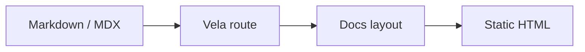

<p align="center">
  <h1 align="center">Vela</h1>
</p>

<p align="center">
  <b>A clean, reusable Astro documentation framework.</b><br/>
  No Starlight lock-in, no project-specific theme hacks — just one polished docs shell with routing, MDX, navigation, i18n, search, metadata, diagrams, and a configurable homepage.
</p>

<p align="center">
  <a href="https://github.com/duxweb/vela">Repository</a> &middot;
  <a href="#quick-start">Quick Start</a> &middot;
  <a href="#configuration">Configuration</a> &middot;
  <a href="#published-exports">Exports</a> &middot;
  <a href="https://github.com/duxweb/vela/issues">Feedback</a>
</p>

<p align="center">
  English | <a href="README.zh-CN.md">简体中文</a>
</p>

<p align="center">
  <a href="https://www.npmjs.com/package/@duxweb/vela"></a>
  <a href="LICENSE"></a>
  
  
</p>

---

## Why Vela

Most documentation sites end up in one of two places: a heavy theme that is hard to reshape, or repeated project-local layout code. Vela keeps the reusable shell in one package while leaving product-specific homepages and content structure in each project.

| Docs friction | Vela's answer |
| :--- | :--- |
| Theme overrides become fragile | Built directly on Astro, with no Starlight override layer. |
| Every project rebuilds the same docs shell | Shared route, layout, header, sidebar, TOC, pagination, and metadata. |
| Homepage design differs per product | Default homepage included, custom `Hero` supported per project. |
| Multiple docs sections need different sidebars | Path-based `docs` sections with longest-match selection. |
| Language routing is repetitive | Locale-aware nav, sidebar links, alternates, and UI strings. |
| Code blocks need polish | Built-in copy buttons and optional Mermaid rendering. |
| Package usage breaks after publish | `dist` build, typed exports, and tarball consumption are verified. |

Vela keeps the public entrypoint intentionally small:

```js
import vela from '@duxweb/vela'

export default defineConfig({
  integrations: [
    vela({
      title: 'Project Docs',
      docs: {...},
    }),
  ],
})
```

## Status

Vela is a **pre-1.0 public package**. The reusable Astro integration, content route, MDX support, default layout, sidebar, header navigation, language/theme/version menus, search, metadata, code copy, Mermaid diagrams, default homepage, custom component overrides, and package build pipeline are implemented.

The package targets **Astro 7+** and **Node.js 22.12+**.

## Install

```bash
pnpm add @duxweb/vela astro
```

Vela installs and injects `@astrojs/mdx` automatically. Projects only need to define the `docs` content collection.

## Quick Start

```js
import { defineConfig } from 'astro/config'
import vela from '@duxweb/vela'

export default defineConfig({
  site: 'https://example.com',
  integrations: [
    vela({
      title: 'Project Docs',
      description: 'Documentation for your project.',
      theme: {
        accent: '#16a34a',
        dark: '#4ade80',
      },
      nav: [
        { label: 'Docs', slug: 'quick-start' },
        { label: 'API', slug: 'reference/api' },
        { label: 'GitHub', href: 'https://github.com/duxweb', external: true },
      ],
      docs: {
        main: {
          match: '/',
          sidebar: [
            {
              label: 'Start',
              items: [
                { label: 'Overview', slug: '' },
                { label: 'Quick Start', slug: 'quick-start' },
              ],
            },
          ],
        },
      },
    }),
  ],
})
```

Create `src/content.config.ts`:

```ts
import { defineCollection } from 'astro:content'
import { glob } from 'astro/loaders'
import { velaDocsSchema } from '@duxweb/vela/schema'

export const collections = {
  docs: defineCollection({
    loader: glob({ base: './src/content/docs', pattern: '**/*.{md,mdx}' }),
    schema: velaDocsSchema,
  }),
}
```

`src/content/docs/index.mdx` becomes `/`. Locale folders such as `src/content/docs/zh-cn/index.mdx` become `/zh-cn/`.

## Configuration

### Theme and Metadata

```js
vela({
  title: 'Project Docs',
  description: 'Documentation for your project.',
  theme: {
    accent: '#16a34a',
    dark: '#4ade80',
  },
  meta: {
    image: '/og.png',
    imageAlt: 'Project documentation',
    keywords: ['docs', 'project'],
    twitter: '@duxweb',
  },
})
```

Page frontmatter can override `title`, `description`, `image`, `imageAlt`, and `keywords`.

```md
---
title: Quick Start
description: Install and configure the project.
image: /og/quick-start.png
updated: 2026-06-28 18:00
---
```

### Homepage

Vela ships a default homepage hero:

```js
vela({
  title: 'Project Docs',
  home: {
    eyebrow: 'Vela',
    badge: 'Reusable docs shell',
    title: 'Documentation that feels calm and direct',
    tagline: 'A polished docs shell for multiple projects.',
    command: 'pnpm add @duxweb/vela',
    actions: [
      { text: 'Start Reading', slug: 'guide', variant: 'primary' },
      { text: 'API', slug: 'api', variant: 'secondary' },
    ],
    features: [
      { label: 'Multiple sidebars', description: 'Switch docs navigation by path.', slug: 'guide' },
    ],
  },
})
```

Projects can fully replace the homepage hero with a local Astro component:

```js
vela({
  title: 'Project Docs',
  components: {
    Hero: './src/components/HomeHero.astro',
  },
  customCss: ['./src/styles/home.css'],
})
```

The custom `Hero` receives `{ entry, route }` props. Homepage-specific layout and marketing styles should stay in the consuming project.

### Navigation and Sections

```js
vela({
  title: 'Project Docs',
  nav: [
    {
      label: 'Docs',
      items: [
        { label: 'Guide', slug: 'guide' },
        { label: 'API', slug: 'api' },
      ],
    },
    { label: 'GitHub', href: 'https://github.com/duxweb/project', external: true },
  ],
  docs: {
    guide: {
      match: '/',
      sidebar: [{ label: 'Start', items: [{ label: 'Overview', slug: '' }] }],
    },
    api: {
      match: '/api',
      sidebar: [{ label: 'API', items: [{ label: 'Options', slug: 'api/options' }] }],
    },
  },
})
```

`slug` links are automatically prefixed with Astro `base` and the current locale. `docs.match` is evaluated after stripping Astro `base` and locale prefixes. When multiple sections match, the longest match wins.

### Internationalization

```js
vela({
  title: 'Project Docs',
  defaultLocale: 'root',
  locales: {
    root: { label: 'English', lang: 'en' },
    'zh-cn': { label: '简体中文', lang: 'zh-CN' },
  },
  nav: [
    {
      label: 'Docs',
      translations: { 'zh-CN': '文档' },
      slug: 'quick-start',
    },
  ],
  i18n: {
    zh: {
      searchPlaceholder: '搜索当前文档',
      editPage: '在 GitHub 上编辑',
    },
  },
})
```

Built-in UI strings include English, Chinese, Japanese, Korean, French, German, Spanish, Portuguese, Russian, Italian, and Arabic. Missing keys fall back to the built-in locale and then English.

### Search, Versions, and Edit Links

```js
vela({
  title: 'Project Docs',
  search: {
    placeholder: 'Search docs',
    translations: { 'zh-CN': '搜索文档' },
  },
  versions: [
    { label: 'v1.x', href: '/v1/' },
    { label: 'v0.x', href: '/v0/' },
  ],
  editLink: {
    pattern: 'https://github.com/org/repo/edit/main/:path',
    label: 'Edit this page',
    translations: { 'zh-CN': '编辑此页' },
  },
})
```

Available edit-link placeholders are `:path`, `:id`, `:slug`, and `:locale`. A page can override the URL with `editUrl` frontmatter.

### Table of Contents and Diagrams

```js
vela({
  title: 'Project Docs',
  tableOfContents: {
    minHeadingLevel: 2,
    maxHeadingLevel: 3,
  },
  mermaid: true,
})
```

Set `tableOfContents: false` to disable the right-side table of contents. Set `mermaid: false` when a project does not need diagrams.

````md

````

## Custom Components

Vela exposes replaceable shell components:

```js
vela({
  title: 'Project Docs',
  components: {
    Head: './src/components/Head.astro',
    Header: './src/components/Header.astro',
    Sidebar: './src/components/Sidebar.astro',
    Pagination: './src/components/Pagination.astro',
    Hero: './src/components/Hero.astro',
    Search: './src/components/Search.astro',
    VersionSelect: './src/components/VersionSelect.astro',
    EditPage: './src/components/EditPage.astro',
  },
})
```

Most projects should only replace `Hero` and add `customCss`.

## Published Exports

| Export | Purpose |
| :--- | :--- |
| `@duxweb/vela` | Astro integration and public option types. |
| `@duxweb/vela/schema` | Content collection schemas. |
| `@duxweb/vela/components/*` | Default Astro components for advanced overrides. |
| `@duxweb/vela/styles/*` | Default CSS assets. |

## Local Development

```bash
pnpm install
pnpm check
pnpm build
pnpm build:example
pnpm pack --dry-run
```

## Release

```bash
pnpm check
pnpm build
pnpm build:example
pnpm publish
```
