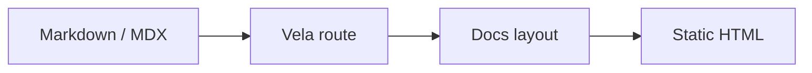

<p align="center">
  <h1 align="center">Vela</h1>
</p>

<p align="center">
  <b>一个简洁、可复用的 Astro 文档框架。</b><br/>
  不绑定 Starlight，不堆项目级样式覆盖；只提供稳定的文档外壳：路由、MDX、导航、多语言、搜索、元信息、流程图和可配置首页。
</p>

<p align="center">
  <a href="https://github.com/duxweb/vela">仓库</a> &middot;
  <a href="#快速开始">快速开始</a> &middot;
  <a href="#配置">配置</a> &middot;
  <a href="#发布导出">导出</a> &middot;
  <a href="https://github.com/duxweb/vela/issues">反馈</a>
</p>

<p align="center">
  <a href="README.md">English</a> | 简体中文
</p>

<p align="center">
  <a href="https://www.npmjs.com/package/@duxweb/vela"></a>
  <a href="LICENSE"></a>
  
  
</p>

---

## 为什么是 Vela

很多文档站最后都会走向两个问题：主题太重不好改，或者每个项目重复维护一套文档布局。Vela 把可复用的文档外壳放进一个包，同时把产品首页和内容结构留给项目自己控制。

| 文档站痛点 | Vela 的处理方式 |
| :--- | :--- |
| 主题覆盖容易变成 hack | 直接基于 Astro 构建，没有 Starlight 覆盖层。 |
| 每个项目重复写文档外壳 | 统一路由、布局、Header、Sidebar、TOC、分页和元信息。 |
| 每个产品首页都不一样 | 内置默认首页，也支持项目替换 `Hero`。 |
| 多个文档区需要不同侧栏 | 基于路径匹配不同 `docs` 分区，最长匹配优先。 |
| 多语言链接重复处理 | 内置语言感知的导航、侧栏、alternate 和 UI 文案。 |
| 代码块需要基础体验 | 内置复制按钮和 Mermaid 流程图渲染。 |
| 发布后才发现包不可用 | 构建产物、类型导出和 tarball 消费测试都已验证。 |

公开入口保持很小：

```js
import vela from '@duxweb/vela'

export default defineConfig({
  integrations: [
    vela({
      title: 'Project Docs',
      docs: {...},
    }),
  ],
})
```

## 状态

Vela 是 **pre-1.0 公开包**。Astro 集成、内容路由、MDX、默认布局、侧栏、顶部导航、语言/主题/版本菜单、搜索、元信息、代码复制、Mermaid、默认首页、组件替换和发布构建流程都已经实现。

当前要求 **Astro 7+** 和 **Node.js 22.12+**。

## 安装

```bash
pnpm add @duxweb/vela astro
```

Vela 会自动安装并注入 `@astrojs/mdx`。项目只需要定义 `docs` 内容集合。

## 快速开始

```js
import { defineConfig } from 'astro/config'
import vela from '@duxweb/vela'

export default defineConfig({
  site: 'https://example.com',
  integrations: [
    vela({
      title: 'Project Docs',
      description: 'Documentation for your project.',
      theme: {
        accent: '#16a34a',
        dark: '#4ade80',
      },
      nav: [
        { label: 'Docs', slug: 'quick-start' },
        { label: 'API', slug: 'reference/api' },
        { label: 'GitHub', href: 'https://github.com/duxweb', external: true },
      ],
      docs: {
        main: {
          match: '/',
          sidebar: [
            {
              label: 'Start',
              items: [
                { label: 'Overview', slug: '' },
                { label: 'Quick Start', slug: 'quick-start' },
              ],
            },
          ],
        },
      },
    }),
  ],
})
```

创建 `src/content.config.ts`：

```ts
import { defineCollection } from 'astro:content'
import { glob } from 'astro/loaders'
import { velaDocsSchema } from '@duxweb/vela/schema'

export const collections = {
  docs: defineCollection({
    loader: glob({ base: './src/content/docs', pattern: '**/*.{md,mdx}' }),
    schema: velaDocsSchema,
  }),
}
```

`src/content/docs/index.mdx` 会变成 `/`。例如 `src/content/docs/zh-cn/index.mdx` 会变成 `/zh-cn/`。

## 配置

### 主题和元信息

```js
vela({
  title: 'Project Docs',
  description: 'Documentation for your project.',
  theme: {
    accent: '#16a34a',
    dark: '#4ade80',
  },
  meta: {
    image: '/og.png',
    imageAlt: 'Project documentation',
    keywords: ['docs', 'project'],
    twitter: '@duxweb',
  },
})
```

页面 frontmatter 可以覆盖 `title`、`description`、`image`、`imageAlt`、`keywords`。

```md
---
title: Quick Start
description: Install and configure the project.
image: /og/quick-start.png
updated: 2026-06-28 18:00
---
```

### 首页

Vela 内置默认首页：

```js
vela({
  title: 'Project Docs',
  home: {
    eyebrow: 'Vela',
    badge: 'Reusable docs shell',
    title: 'Documentation that feels calm and direct',
    tagline: 'A polished docs shell for multiple projects.',
    command: 'pnpm add @duxweb/vela',
    actions: [
      { text: 'Start Reading', slug: 'guide', variant: 'primary' },
      { text: 'API', slug: 'api', variant: 'secondary' },
    ],
    features: [
      { label: 'Multiple sidebars', description: 'Switch docs navigation by path.', slug: 'guide' },
    ],
  },
})
```

项目也可以完全替换首页 Hero：

```js
vela({
  title: 'Project Docs',
  components: {
    Hero: './src/components/HomeHero.astro',
  },
  customCss: ['./src/styles/home.css'],
})
```

自定义 `Hero` 会收到 `{ entry, route }` props。首页营销样式建议放在项目里，不放进通用主题。

### 导航和分区

```js
vela({
  title: 'Project Docs',
  nav: [
    {
      label: 'Docs',
      items: [
        { label: 'Guide', slug: 'guide' },
        { label: 'API', slug: 'api' },
      ],
    },
    { label: 'GitHub', href: 'https://github.com/duxweb/project', external: true },
  ],
  docs: {
    guide: {
      match: '/',
      sidebar: [{ label: 'Start', items: [{ label: 'Overview', slug: '' }] }],
    },
    api: {
      match: '/api',
      sidebar: [{ label: 'API', items: [{ label: 'Options', slug: 'api/options' }] }],
    },
  },
})
```

`slug` 会自动加上 Astro `base` 和当前语言前缀。`docs.match` 会在移除 `base` 和语言前缀后匹配，多个分区匹配时最长路径优先。

### 多语言

```js
vela({
  title: 'Project Docs',
  defaultLocale: 'root',
  locales: {
    root: { label: 'English', lang: 'en' },
    'zh-cn': { label: '简体中文', lang: 'zh-CN' },
  },
  nav: [
    {
      label: 'Docs',
      translations: { 'zh-CN': '文档' },
      slug: 'quick-start',
    },
  ],
  i18n: {
    zh: {
      searchPlaceholder: '搜索当前文档',
      editPage: '在 GitHub 上编辑',
    },
  },
})
```

内置 UI 文案包含英文、中文、日文、韩文、法文、德文、西班牙文、葡萄牙文、俄文、意大利文和阿拉伯文。缺少的 key 会回退到内置语言，再回退到英文。

### 搜索、版本和编辑链接

```js
vela({
  title: 'Project Docs',
  search: {
    placeholder: 'Search docs',
    translations: { 'zh-CN': '搜索文档' },
  },
  versions: [
    { label: 'v1.x', href: '/v1/' },
    { label: 'v0.x', href: '/v0/' },
  ],
  editLink: {
    pattern: 'https://github.com/org/repo/edit/main/:path',
    label: 'Edit this page',
    translations: { 'zh-CN': '编辑此页' },
  },
})
```

编辑链接支持 `:path`、`:id`、`:slug`、`:locale` 占位符。单个页面可以用 `editUrl` frontmatter 覆盖。

### 目录和流程图

```js
vela({
  title: 'Project Docs',
  tableOfContents: {
    minHeadingLevel: 2,
    maxHeadingLevel: 3,
  },
  mermaid: true,
})
```

设置 `tableOfContents: false` 可以关闭右侧目录。设置 `mermaid: false` 可以关闭流程图渲染。

````md

````

## 自定义组件

Vela 暴露可替换的外壳组件：

```js
vela({
  title: 'Project Docs',
  components: {
    Head: './src/components/Head.astro',
    Header: './src/components/Header.astro',
    Sidebar: './src/components/Sidebar.astro',
    Pagination: './src/components/Pagination.astro',
    Hero: './src/components/Hero.astro',
    Search: './src/components/Search.astro',
    VersionSelect: './src/components/VersionSelect.astro',
    EditPage: './src/components/EditPage.astro',
  },
})
```

大多数项目只需要替换 `Hero` 并追加 `customCss`。

## 发布导出

| 导出 | 用途 |
| :--- | :--- |
| `@duxweb/vela` | Astro 集成和公开配置类型。 |
| `@duxweb/vela/schema` | 内容集合 schema。 |
| `@duxweb/vela/components/*` | 默认 Astro 组件，适合高级覆盖。 |
| `@duxweb/vela/styles/*` | 默认 CSS 资源。 |

## 本地开发

```bash
pnpm install
pnpm check
pnpm build
pnpm build:example
pnpm pack --dry-run
```

## 发布

```bash
pnpm check
pnpm build
pnpm build:example
pnpm publish
```
