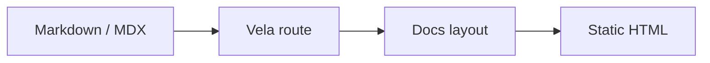

## Install

```bash
pnpm add @duxweb/vela astro
```

## Configure

```js
import vela from '@duxweb/vela'

export default {
  integrations: [
    vela({
      title: 'Project Docs',
      docs: {},
    }),
  ],
}
```

## Customize the homepage

Vela does not own homepage layout or homepage CSS. Keep those files in the consuming project:

```js
vela({
  title: 'Project Docs',
  components: {
    Hero: './src/components/HomeHero.astro',
  },
  customCss: ['./src/styles/home.css'],
})
```

This keeps the theme reusable and prevents project-specific landing-page styles from leaking into every documentation site.

## Diagrams

Vela renders Mermaid diagrams from fenced code blocks:


